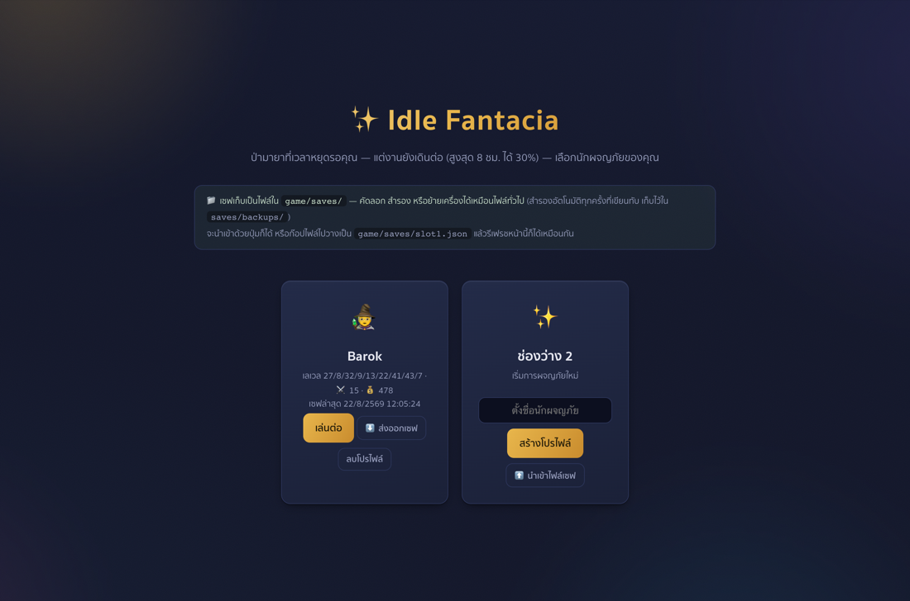
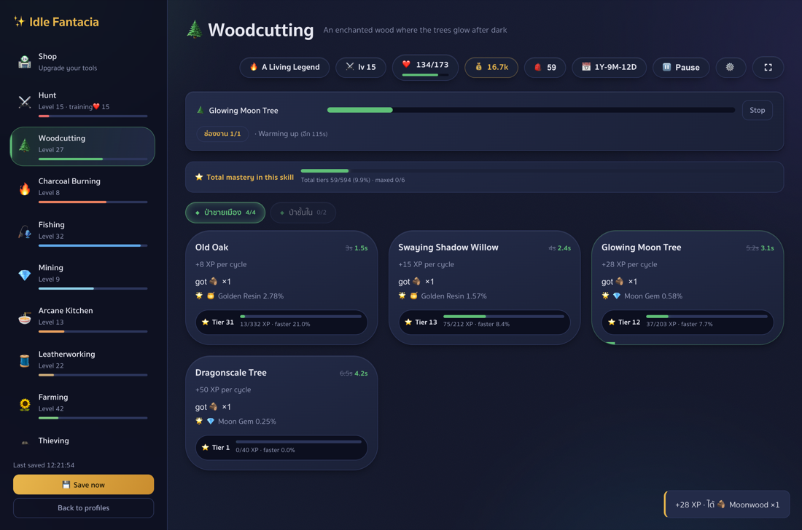
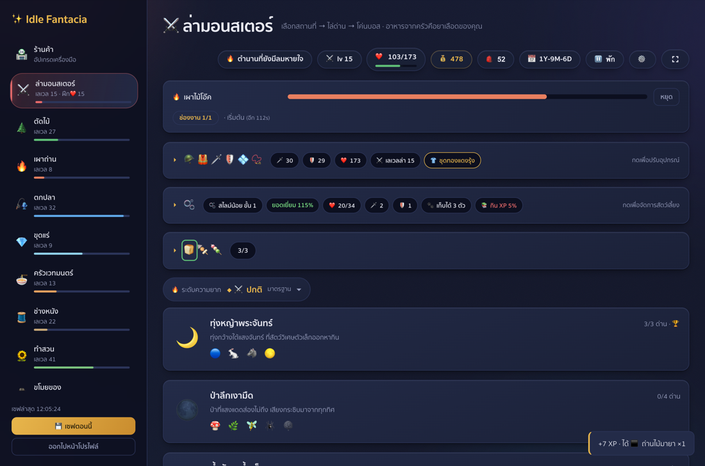
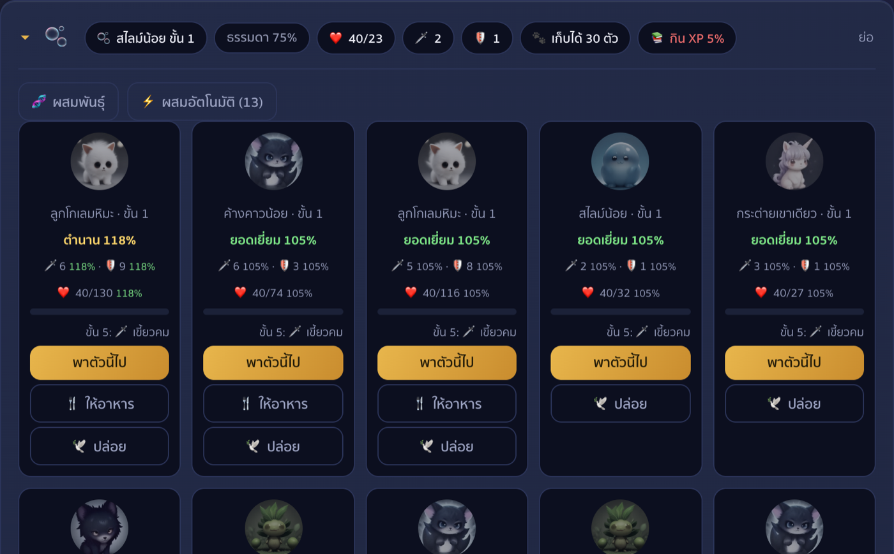
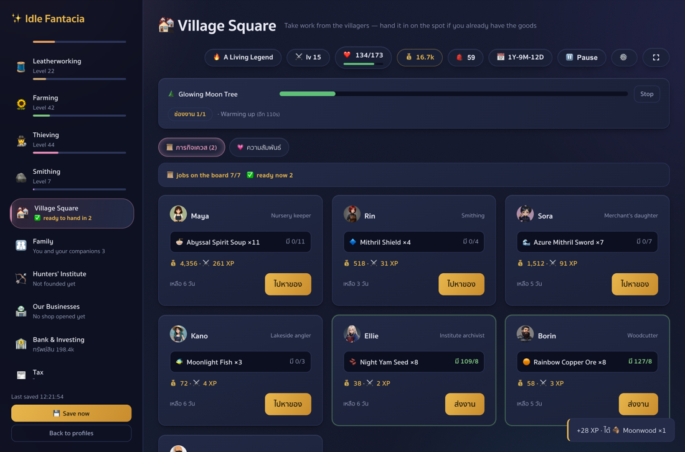
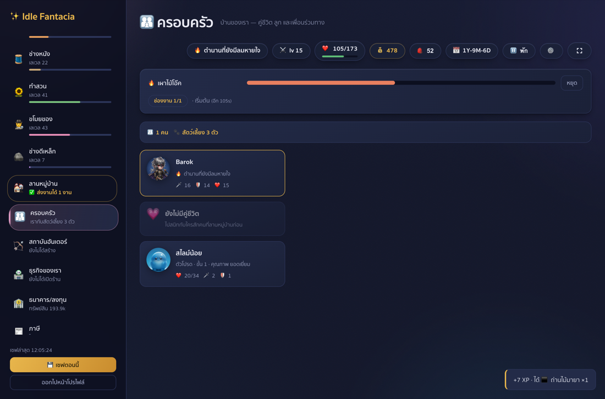
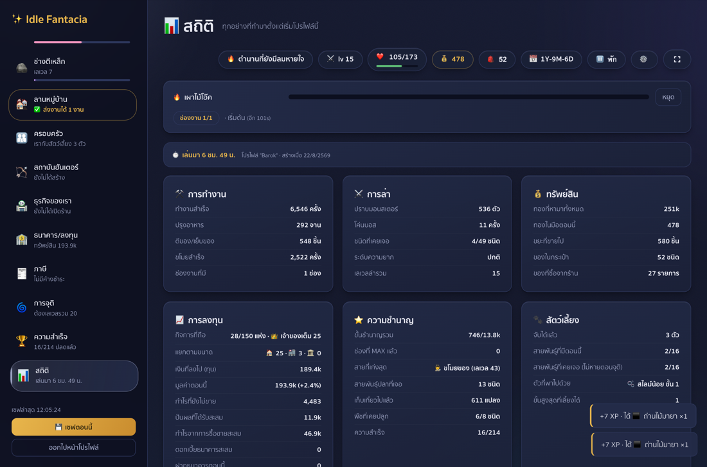
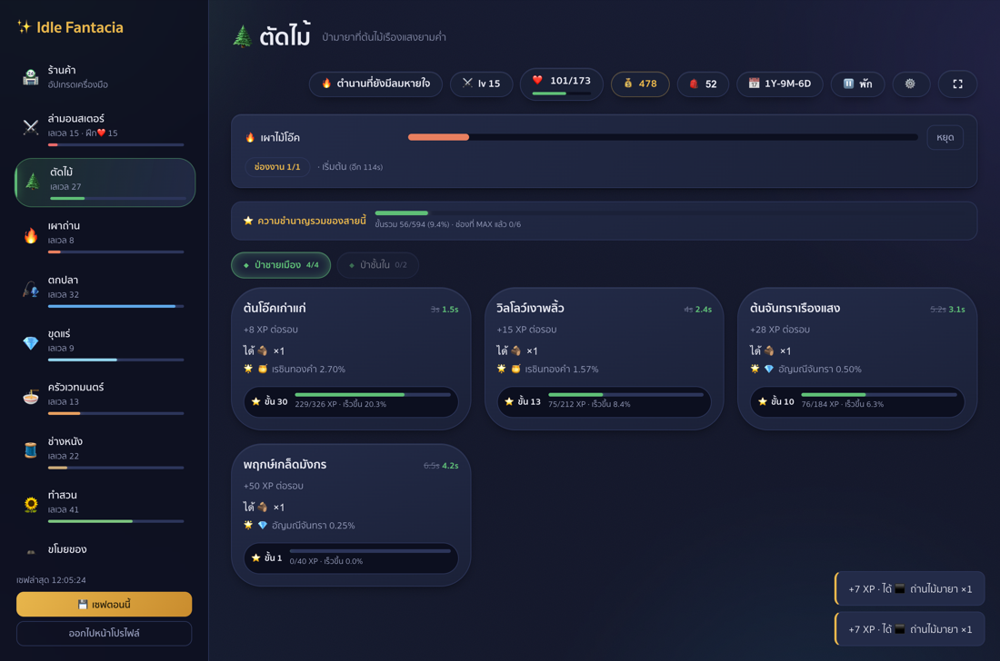
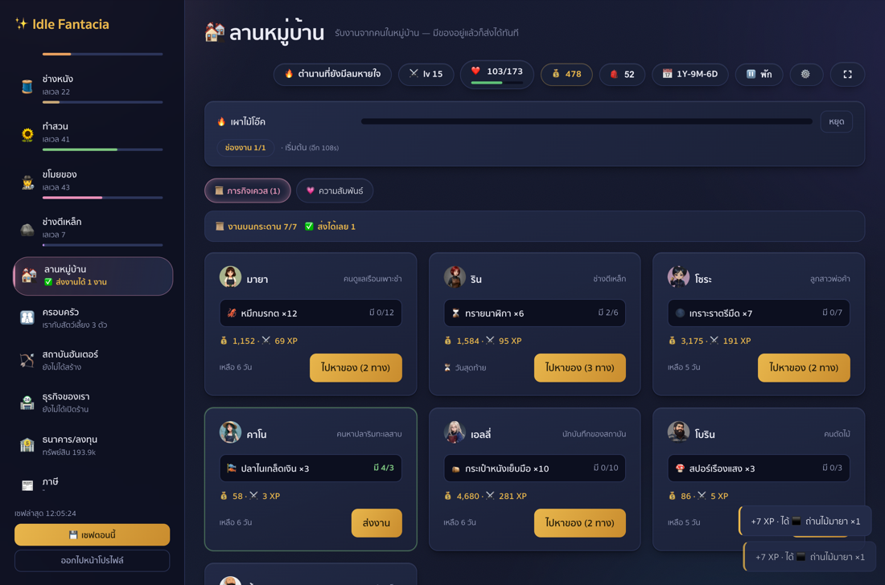

<div align="center">

# ✨ Idle Fantacia

**An idle RPG that runs entirely in your browser — no install, no account, no server**

**Plays on a phone as well as a desktop** — the layout adapts, and the screen stays awake while you watch

**เกม idle ที่รันในเบราว์เซอร์ล้วน — ไม่ต้องติดตั้ง ไม่ต้องสมัคร ไม่ต้องมีเซิร์ฟเวอร์**

**เล่นบนมือถือได้เหมือนกัน** — หน้าจอปรับตามขนาดเครื่อง และมีระบบกันจอดับตอนนั่งดู

### ▶︎ **[Play now / เล่นเลย](https://arcticfox2029.github.io/idle-fantacia/)**

[English](#english) · [ภาษาไทย](#ภาษาไทย)



</div>

---

# English

> **The game opens in Thai by default.** Click the ⚙️ gear in the top bar and pick **🇬🇧 English**.
> Your choice is remembered by the browser.
>
> **The game world is fully translated** — all 164 items, every monster, skill, job, achievement,
> villager, company and property, plus the navigation, job cards, buttons and status bar.
>
> **The interface is not finished.** Longer explanations inside the achievements, shop, rebirth and
> statistics panels are still Thai. Anything untranslated falls back to Thai rather than breaking,
> so those screens read as Thai rather than as anything broken. The test suite measures exactly how
> much is left on each screen and fails if it grows, so this only moves in one direction.

## What an idle game is

You **set work going and walk away**. There is no clicking to keep up with. Jobs keep running while
you do something else, and they keep running after you close the tab — offline you earn 30% of the
normal rate, for up to 8 hours.

## How to play

### 1. Pick a skill and start a job

Nine skills. Click one job card and leave it. Repeating a job builds **mastery**, which makes it
faster and improves what it drops.



### 2. Go hunting

Turn what you gather into weapons and armour, then hunt. A companion soaks damage for you — and
once you have killed 1,000 of a species, **it starts to fear you** and hits softer.



Companions have seven grades, and the top two are effectively **breed-only** — wild catches almost
never reach them. Fuse two of the same grade and you have a chance at the next one up, so a hoard of
ordinary catches is raw material rather than clutter. **⚡ Auto-fuse** does the whole roster in one
press, finishing the lowest grade before moving up. It leaves alone the companion you are fielding
and the top grade, which has nothing to climb to.



### 3. The village square — work, and courting

Every villager has a job for you. Open it and the game checks your bag: hold the goods and you hand
it in on the spot; if you do not, press **"go and get it"** and pick which source you feel like
playing.

The other tab is relationships. Give gifts to grow closer, all the way to marriage — and **each of
them helps with something different**: faster crops, more damage, better selling prices, more rare
finds, or more XP.



### 4. Family

Once married there is a **1% chance each in-game day per wife** of a child, and each wife has her own switch to stop trying. Four children per life; being reborn starts that count over, and a child carried over from a previous life does not spend the new life's quota. A household costs money every day — a wife, each child, and every level of schooling a child holds — and falling behind suspends what the family gives back. A child starts at half of what
you were the day they were born, then grows. You choose what to have them taught — **the higher the
tier, the more it costs and the slower it pays back**.



### 5. Rebirth — and what survives it

When you are strong enough you may be **reborn**: combat stats halve, in exchange for karma that
stays with you forever. What survives and what does not is designed to be predictable:

| Survives | Halved | Lost |
|---|---|---|
| Achievements and titles · slayer marks · deposits, shares, businesses, property · marriages and every relationship · **children and everything you taught them** | Combat stats | Gold in hand |

A rebirth costs you your combat stats and the gold in your hand. It does **not** touch the people:
relationships, marriages, children and everything you paid to teach them all carry over. What resets
is the quota — four births per life — so a household only ever grows, and the daily upkeep with it.

### 6. Statistics — one page for everything



## Where saves live

In your **browser's local storage**, per site. That means:

- Saves stay on the device and browser you played on.
- Clearing site data clears them.
- Move a save with **export / import** on the profile screen — it writes a file you can carry to
  another browser or machine.

Nothing is ever sent anywhere. No account, no tracking, no analytics.

## Make it your own

Download the [latest release](../../releases) and unpack it, or clone this repository.

```bash
python3 -m http.server 8000
# then open http://localhost:8000
```

That is all — no `npm install`, no build step, no Node.

### Where things are

| File | What it is |
|---|---|
| `data.js` | **Every number in the game** — items, skills, jobs, monsters, prices, achievements. Balance changes go here |
| `game.js` | Rules and rendering |
| `i18n.js` | Thai → English dictionary, keyed by the Thai string itself |
| `style.css` | All of the look |
| `art/` | Monsters, companions, characters |
| `dist/ui.js` | The built React islands (source lives in the development repo) |

### Try changing something

Open `data.js`:

```js
// make woodcutting ten times faster — find the action and drop its seconds
{ id: "oak", name: "ต้นโอ๊คเก่าแก่", seconds: 0.15, ... }

// add an item
newthing: { name: "My New Thing", icon: "🌟", sell: 999 },
```

Refresh the page and it is there. No build.

> **One trap worth knowing:** `GAME_VERSION` in `data.js` is both the cache-buster **and** the
> save-compatibility key. Moving it without adding the matching `migrate()` step turns **every
> existing save into an empty slot**.

### Adding a language

`i18n.js` uses the Thai string as the key, so a new language is another object of the same shape.
Anything you have not translated shows in Thai instead of breaking.

## Licence

MIT — do anything you like with it, including selling it.

Art in `art/` was generated with [pollinations.ai](https://pollinations.ai).

---

# ภาษาไทย

> **เกมเปิดมาเป็นภาษาไทยอยู่แล้ว** ถ้าอยากเปลี่ยนเป็นอังกฤษ กด ⚙️ บนแถบบนแล้วเลือก **🇬🇧 English**
> เบราว์เซอร์จะจำค่าที่เลือกไว้ให้

## เกม idle คืออะไร

คุณ **สั่งงานแล้วเดินหนี** ไม่ต้องนั่งกดรัว ๆ งานเดินต่อขณะคุณทำอย่างอื่น และเดินต่อแม้ปิดแท็บไปแล้ว —
ตอนออฟไลน์ได้ 30% ของปกติ สูงสุด 8 ชั่วโมง

## เล่นยังไง

### 1. เลือกอาชีพแล้วสั่งงาน

มี 9 สายอาชีพ กดการ์ดงานหนึ่งใบแล้วปล่อยไว้ ยิ่งทำซ้ำยิ่ง **ชำนาญ** ขึ้น ซึ่งทำให้เร็วขึ้นและได้ของดีขึ้น



### 2. ออกล่า

เอาของที่หาได้ไปตีเป็นอาวุธและเกราะ แล้วออกล่า สัตว์เลี้ยงช่วยรับดาเมจแทนคุณได้ —
และล่าสายพันธุ์เดิมครบ 1,000 ตัวเมื่อไหร่ **มันจะเริ่มกลัวคุณ** แล้วตีเบาลง

สัตว์เลี้ยงมี 7 ขั้น และสองขั้นบนสุดแทบ **ต้องผสมเอาเท่านั้น** — จับเอาในป่าโอกาสต่ำกว่า 1%
ผสมสองตัวขั้นเดียวกันแล้วมีลุ้นขึ้นขั้น กองตัวธรรมดาที่สะสมไว้จึงเป็นวัตถุดิบ ไม่ใช่ขยะ
กด **⚡ ผสมอัตโนมัติ** ทีเดียวจบทั้งกอง ไล่จากขั้นต่ำสุดขึ้นไป
ไม่แตะตัวที่คุณพาลงสนาม และไม่ผสมขั้นสูงสุดซึ่งไม่มีที่ให้ไปต่อ


### 3. ลานหมู่บ้าน — รับงาน และจีบสาว

ชาวบ้านทุกคนมีงานให้ กดดูแล้วเกมเช็คกระเป๋าให้ทันที มีของครบก็ส่งได้เลย ไม่มีก็กด **"ไปหาของ"**
แล้วเลือกได้ว่าจะไปทางไหน

อีกแท็บคือความสัมพันธ์ ให้ของขวัญเพื่อสนิทขึ้นจนถึงขั้นแต่งงาน **แต่ละคนหนุนคนละอย่าง** —
พืชโตเร็วขึ้น ดาเมจมากขึ้น ขายได้ราคาดีขึ้น เจอของหายากบ่อยขึ้น หรือได้ XP มากขึ้น



### 4. ครอบครัว

แต่งงานแล้วมีลูกได้ (โอกาส **1% ต่อวันในเกม** และภรรยาแต่ละคนมีลูกได้ปีละคน) รอบจุติหนึ่งมีลูกได้ 4 คน — เพดานเป็นของทั้งครัวเรือน ไม่ใช่ของภรรยาแต่ละคน และคุมกำเนิดรายคนได้จากการ์ดของภรรยา ลูกที่ติดตัวมาจากชาติก่อนไม่นับ · ครอบครัวมีค่าเลี้ยงดูรายวัน ถ้าจ่ายไม่ไหวโบนัสจะหยุดจนกว่าจะเคลียร์ ลูกเริ่มด้วยค่าสถานะครึ่งหนึ่งของคุณตอนที่เขาเกิด แล้วค่อย ๆ โต
คุณเลือกได้ว่าจะให้เรียนอะไร — **ยิ่งขั้นสูงยิ่งแพงและคืนทุนช้า**

### 5. การจุติ — และสิ่งที่รอด

เมื่อแข็งแกร่งพอ คุณเลือก **จุติ** ได้ สเตตัสการต่อสู้จะถูกหารครึ่ง แลกกับบุญที่ติดตัวไปตลอด
สิ่งที่รอดกับไม่รอดถูกออกแบบให้เดาได้:

| รอดถาวร | หารครึ่ง | หายไป |
|---|---|---|
| ความสำเร็จและฉายา · รอยล่า · เงินฝาก หุ้น ธุรกิจ อสังหา · การแต่งงานและความสัมพันธ์ทั้งหมด · **ลูกและการเรียนทั้งหมดของเขา** | สเตตัสการต่อสู้ | ทองในมือ |

การจุติเสียแค่สเตตัสการต่อสู้กับทองในมือ **ไม่แตะผู้คนเลย** — ความสัมพันธ์ การแต่งงาน ลูก และการเรียนทั้งหมดที่ลงทุนไป อยู่ต่อครบ สิ่งที่รีเซ็ตคือโควตา 4 คนต่อรอบจุติ ครอบครัวจึงมีแต่โตขึ้น และค่าเลี้ยงดูโตตาม

## เซฟอยู่ไหน

เก็บใน **localStorage ของเบราว์เซอร์** แยกตามเว็บไซต์ แปลว่า:

- เซฟอยู่กับเครื่องและเบราว์เซอร์ที่คุณเล่น
- ล้างข้อมูลเว็บไซต์ = เซฟหาย
- ย้ายเซฟได้ด้วยปุ่ม **ส่งออก / นำเข้า** บนหน้าโปรไฟล์

ไม่มีอะไรถูกส่งออกไปไหนทั้งนั้น ไม่มีบัญชี ไม่มีการเก็บข้อมูล

## เอาไปทำต่อเอง

โหลด [release ล่าสุด](../../releases) แล้วแตกไฟล์ หรือ clone repo นี้

```bash
python3 -m http.server 8000
# แล้วเปิด http://localhost:8000
```

เท่านั้นเอง — ไม่ต้อง `npm install` ไม่ต้อง build ไม่ต้องมี Node

| ไฟล์ | คืออะไร |
|---|---|
| `data.js` | **ตัวเลขทั้งเกม** — ไอเทม อาชีพ งาน มอนสเตอร์ ราคา ความสำเร็จ อยากปรับสมดุลแก้ที่นี่ |
| `game.js` | กติกาและการวาดหน้าจอ |
| `i18n.js` | พจนานุกรมไทย→อังกฤษ ใช้ข้อความไทยเป็นคีย์ |
| `style.css` | หน้าตาทั้งหมด |
| `art/` | รูปมอนสเตอร์ สัตว์เลี้ยง ตัวละคร |

แก้ `data.js` แล้วรีเฟรชก็เห็นผลทันที

> **กับดักที่ควรรู้:** `GAME_VERSION` ใน `data.js` เป็นทั้งตัวล้าง cache **และ** กุญแจความเข้ากันของเซฟ
> ขยับเลขนี้โดยไม่เขียนขั้น `migrate()` ให้ตรงกัน **เซฟทุกอันจะกลายเป็นช่องว่าง**

## สัญญาอนุญาต

MIT — เอาไปทำอะไรก็ได้ รวมถึงทำขาย

รูปในโฟลเดอร์ `art/` สร้างด้วย [pollinations.ai](https://pollinations.ai)
